# 📈 SmartStock-ML-Predictor

### Intelligent Stock Market Analysis using Machine Learning

A powerful **Machine Learning-based web application** that analyzes stock market data, trains **17 ML models (classification + regression)**, and automatically selects the best model to predict stock price and trend with high accuracy.

---

## 🚀 Features

✨ **17 Machine Learning Models**
→ Includes **9 Classification** + **8 Regression** models for comprehensive analysis

⚡ **Automatic Best Model Selection**
→ Chooses the top-performing model based on evaluation metrics

📡 **Real-time Stock Data Integration**
→ Fetches live data using *yFinance API*

🧠 **Advanced Feature Engineering**
→ 30+ technical indicators including RSI, MACD, Bollinger Bands

🎨 **Interactive Web UI**
→ Built with *Streamlit* for smooth and user-friendly experience

📈 **Trend Prediction (UP / DOWN)**
→ Predicts market direction with confidence score

📊 **Performance Evaluation Metrics**
→ Accuracy, Precision, Recall, F1-Score & Confusion Matrix

📉 **Visual Insights & Graphs**
→ Rich charts for analysis and model comparison

💾 **Model Saving Capability**
→ Save trained models for future use


---

## 🧠 Model System

### 📊 Classification (Trend Prediction)

Predicts whether stock will go **UP 📈 or DOWN 📉**

* Logistic Regression
* Decision Tree
* Random Forest
* KNN
* SVM
* Naive Bayes
* AdaBoost
* Gradient Boosting
* XGBoost

---

### 📉 Regression (Price Prediction)

Predicts **future stock price**

* Linear Regression
* Decision Tree Regressor
* Random Forest Regressor
* KNN Regressor
* SVR
* AdaBoost Regressor
* Gradient Boosting Regressor
* XGBoost Regressor

---

## 🏆 Smart Model Selection

* **Classification → F1 Score**
* **Regression → R² Score**

Automatically selects the **best performing model** 🔥

---

## 📁 Project Structure

```bash
stock_ml_project/
│
├── app.py
├── train.py
├── evaluation.py
├── run_pipeline.py
├── requirements.txt
├── README.md
│
├── utils/
│   ├── data_fetcher.py
│   ├── visualizer.py
│   └── helpers.py
│
├── outputs/        # Screenshots (used in README)
├── models/
├── data/
├── plots/
└── results/
```

---

## 🧪 Installation & Setup

### 📥 Step 1: Clone Repository

```bash
git clone https://github.com/your-username/SmartStock-ML-Predictor.git
cd SmartStock-ML-Predictor
```

### 🧰 Step 2: Create Virtual Environment

```bash
python -m venv venv
```

```bash
# Windows
venv\Scripts\activate
# macOS/Linux
source venv/bin/activate
```

### 📦 Step 3: Install Dependencies

```bash
pip install -r requirements.txt
```

### ▶️ Step 4: Run Application

```bash
streamlit run app.py
```

Open 👉 http://localhost:8501

---

## 📸 Application Screenshots

### 🖥️ UI Interface

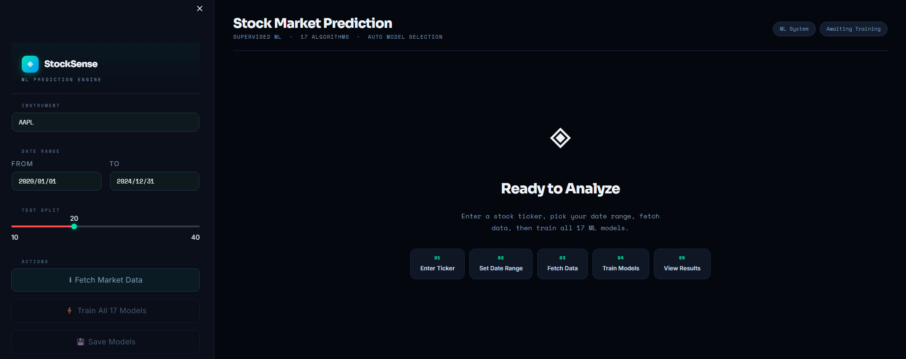

---

### 🤖 Model Training Dashboard

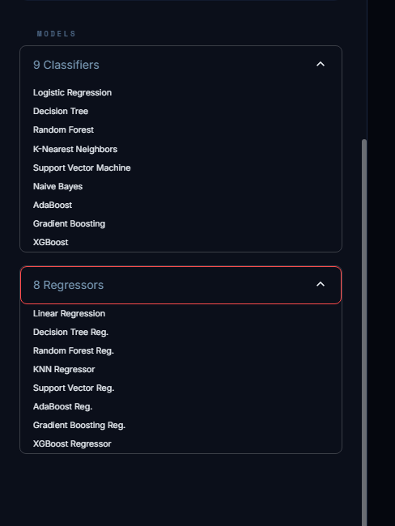

---

### 📥 Data Fetching

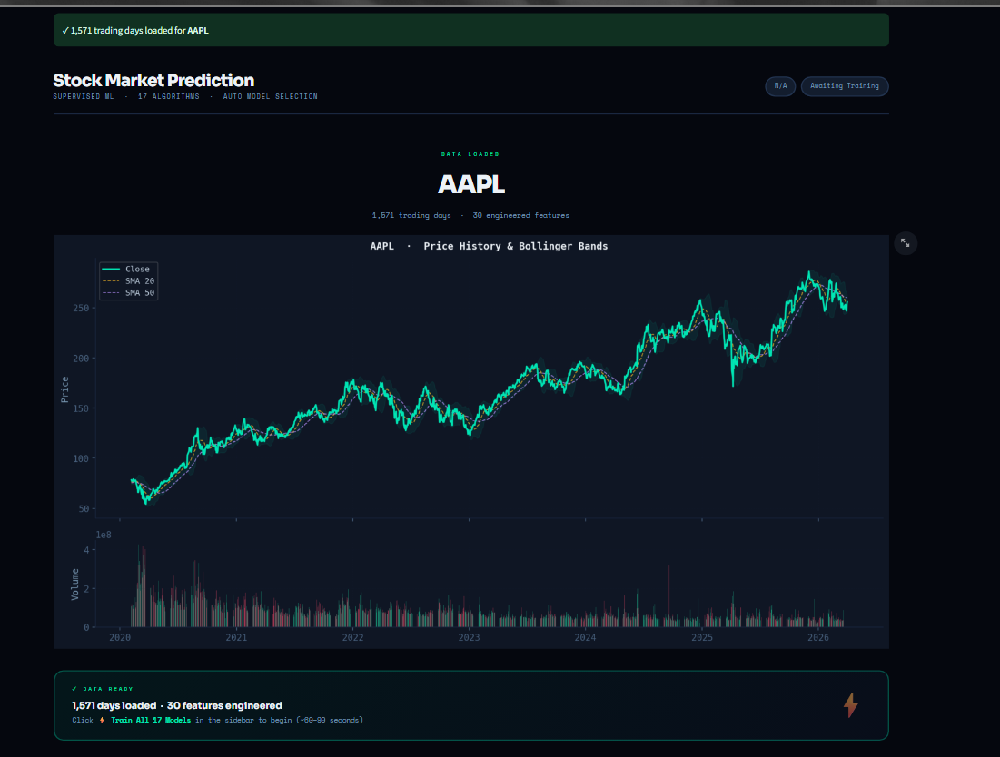

---

### 🔮 Prediction Output

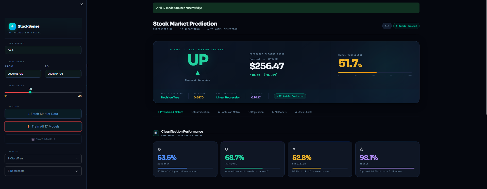

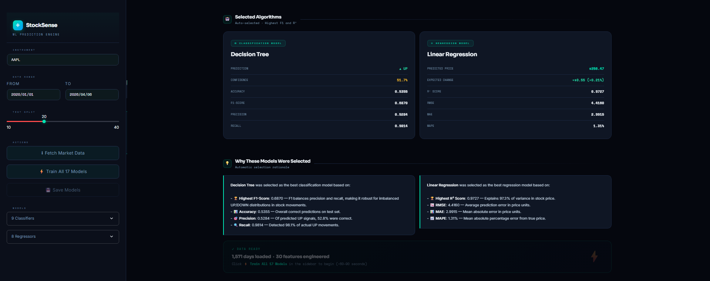

---

### 📊 Classification Results

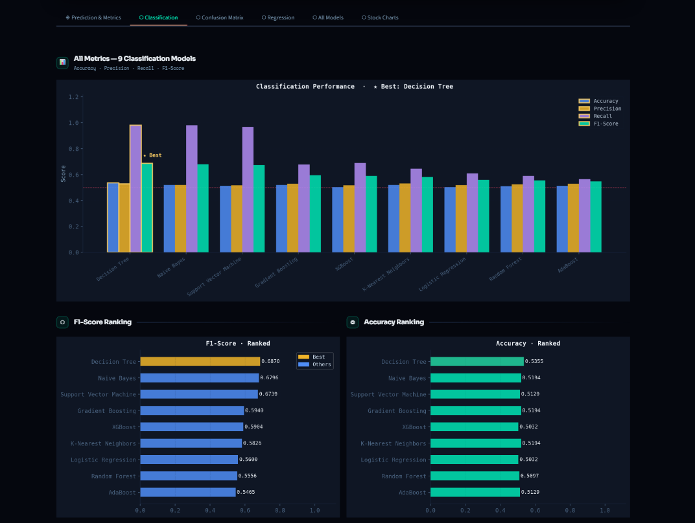

---

### 📉 Regression Results

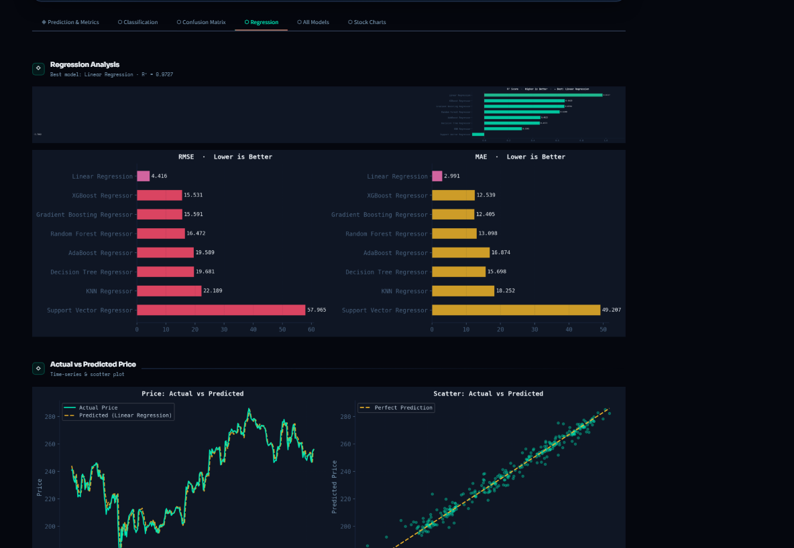

---

### 📌 Confusion Matrix

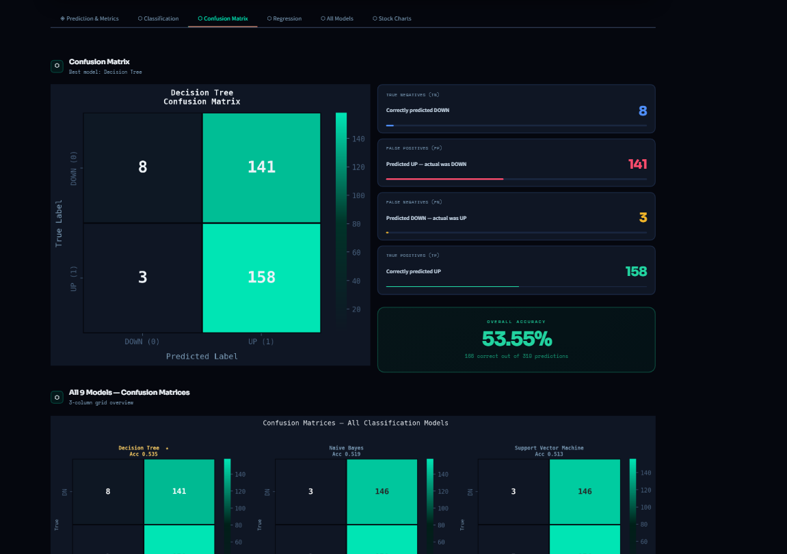

---

### 🧠 All Models Comparison

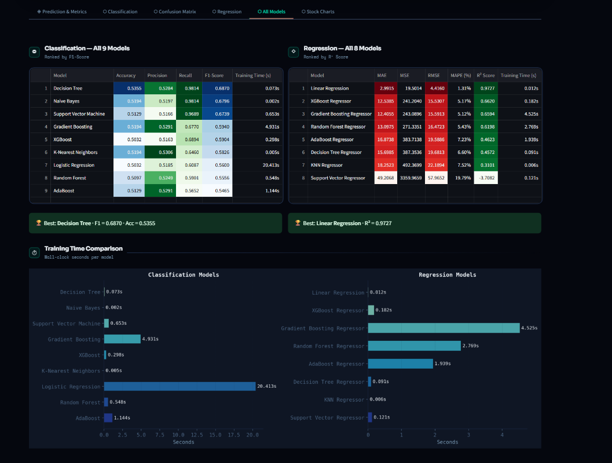

---

### 📈 Charts & Visualizations

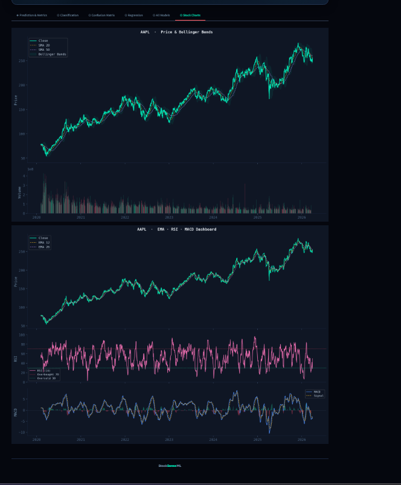

---

### 💾 Save Model Option

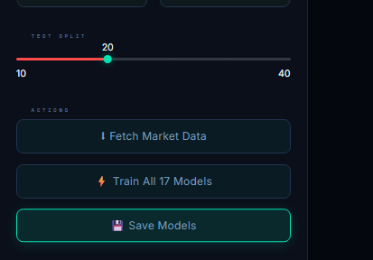


## 📊 Features Engineered

* Moving Averages (SMA, EMA)
* RSI Indicator
* MACD
* Bollinger Bands
* Volatility Metrics
* Momentum Indicators
* Volume Analysis
* Lag Features

---

## 📏 Evaluation Metrics

### Classification

* Accuracy
* Precision
* Recall
* F1 Score

### Regression

* MAE
* MSE
* RMSE
* R² Score
## 🚀 Future Enhancements

* 📡 Add real-time streaming data support for live market predictions
* 📊 Enhance visualization dashboards with interactive analytics

---

## 💼 Use Cases

* 📈 **Stock Market Analysis** – Assist traders in analyzing trends and making informed decisions
* 🤖 **Automated Trading Support** – Provide predictive insights for algorithmic trading systems
* 📡 **Market Monitoring Systems** – Track and predict stock movements in real-time

---

## 👤 Maintainer

<p align="center">
  
  
</p>


## ⭐ Support

If you like this project, give it a ⭐ on GitHub!
